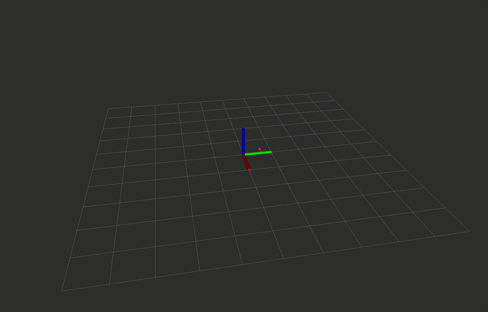

# mmwave-ros



## Table of Contents
1. Introduction
2. Prerequisites
3. Installation and Usage
4. Debugging


## Introduction
A driver for the [IWR6843-ISK](https://www.ti.com/tool/IWR6843ISK) radar from Texas Instrument written in C++ for ROS2 which publishes a pointcloud2.

## Prerequisites
* **ROS2**: Ubuntu 22.04 with Humble and Foxy tested
* **IWR6843-ISK** flashed with out-of-box firmware. See instructions [here](https://www.ti.com/video/6205855073001) for flashing the device.

## Installation and Usage
1. Clone the project and cd into it
    ```bash
    git clone git@github.com:NicolaiAdil/mmwave-ros.git
    cd mmwave-ros
    ```
2. Install neccessary packages, build the project and source it
    ```bash
    rosdep install -i --from-path src --rosdistro humble -y
    colcon build
    source install/setup.bash
    ```
3. Modify the variable `devices` in the launch files to correspond to your radars. Run the following script to list your device id's
    ```bash
    ./extract_device_id.sh
    ```
4. Elevate the privileges of the radar
    ```bash
    sudo chmod 666 /dev/serial/by-id/usb-Silicon_Labs_CP2105_Dual_USB_to_UART_Bridge_Controller_*
    ```
5. Run the project with wanted launch file
    ```bash
    ros2 launch launch/LAUNCH_FILE
    ```


## Debugging

### Failed to open device: Permission denied.

Probably the most common error. Either the device is not plugged in correctly, or permissions have not been elevated correctly.

